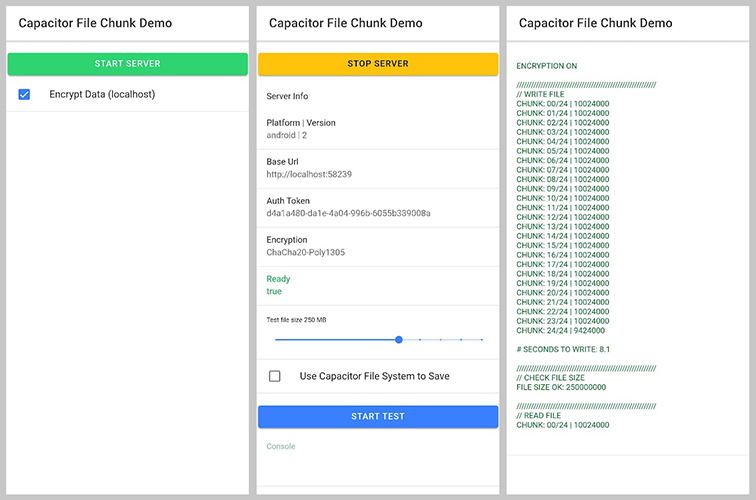

# Capacitor File Chunk

The Capacitor File Chunk plugin, designed for iOS and Android, offers an effective solution to read and write large files, addressing the limitations of the Capacitor Filesystem. This plugin builds on the original concept and code of the [Capacitor Blob Writer](https://github.com/diachedelic/capacitor-blob-writer) plugin by providing the ability to read and write files in chunks, offering improved performance compared to the Capacitor Filesystem plugin. It enables direct communication and exchange of binary data with a localhost web server, eliminating the need for base64 conversion. This approach allows for more efficient and faster handling of large files in iOS and Android applications.

Furthermore, the Capacitor File Chunk plugin incorporates encryption capabilities for improved security. Operating on localhost, the plugin proactively addresses potential security vulnerabilities that may already exist or emerge in the future, such as rogue apps or other threats.

It is important to note that this plugin does not manage file permissions. Appropriate permission handling is crucial in your application to ensure proper file access.

With the Capacitor File Chunk plugin, handling large files is now more efficient and faster than ever.

## Table of Contents

- [Install](#install)
   - [Install Android](#install-android)
   - [Install iOS](#install-ios)
- [Demo](#demo)
- [Usage](#usage)
   - [1. Create the FileChunkManager](#1-create-the-filechunkmanager)
   - [2. Start the server](#2-start-the-server)
   - [3. Create an empty file](#3-create-an-empty-file)
   - [4. Write to a file](#4-write-to-a-file)
   - [5. Check the file size](#5-check-the-file-size)
   - [6. Read from the file](#6-read-from-the-file)
   - [7. Stop the server](#7-stop-the-server)
- [Usage Examples](#usage-examples)
- [Benchmarking](#benchmarking)
- [Security](#security)
- [Final Thoughts](#final-thoughts)


## Install

| Plugin Version | Capacitor Version |
|----------------|-------------------|
| 1.0.0          | Capacitor 5       |
| 0.9.2          | Capacitor 4       |

```bash
npm install capacitor-file-chunk
npx cap sync
```

## Install Android
### 1. Configure `AndroidManifest.xml` to allow localhost.
```xml
<application
    android:usesCleartextTraffic="true"
    ...
```

### 2. Add library to dependencies:
```gradle
// build.gradle
dependencies {
    ...
    implementation 'com.github.joshjdevl.libsodiumjni:libsodium-jni-aar:2.0.1'
}
```
### 3. To fix the warning allowBackup add `xmlns:tools="http://schemas.android.com/tools"` and `tools:replace="android:allowBackup"` to your Manifest:
```xml
<!-- AndroidManifest.xml -->
<?xml version="1.0" encoding="utf-8"?>
<manifest xmlns:android="http://schemas.android.com/apk/res/android"
          xmlns:tools="http://schemas.android.com/tools"
          package="com.name.myapp">
    <application
            ...
            tools:replace="android:allowBackup">
        <activity android:name=".MainActivity">
            ...
        </activity>
    </application>
</manifest>
```

## Install iOS

### 1. Configure `Info.plist` to allow localhost.
```xml
    <key>NSAppTransportSecurity</key>
    <dict>
        <key>NSAllowsArbitraryLoads</key>
        <true/>
    </dict>
```
### 2. Add Apple CryptoKit

Open your Xcode project, and in the menu bar, go to **File -> Add Packages**.... Then, select `swift-crypto` from Apple Swift Packages and click on **Add Package**.

## Demo

A [demonstration](https://github.com/qrclip/capacitor-file-chunk/tree/main/demo) project is provided for you to evaluate and benchmark the Capacitor File Chunk plugin's performance. Within this project, you'll find a class named [FileChunkManager](https://github.com/qrclip/capacitor-file-chunk/tree/main/demo/src/file-chunk-manager), which you can easily integrate into your own application. To take advantage of the plugin's encryption features, it's necessary to install both [libsodium-wrappers](https://www.npmjs.com/package/libsodium-wrappers) and [@types/libsodium-wrappers](https://www.npmjs.com/package/@types/libsodium-wrappers). By exploring the demo project, you can gain a clear understanding of how the Capacitor File Chunk plugin operates and how to utilize it effectively.



In the future, we plan to expand the documentation with more examples showcasing various use cases for the Capacitor File Chunk plugin. Currently, there is an example demonstrating [how to download large files](https://github.com/qrclip/capacitor-file-chunk/tree/main/demo/src/app/download01) using the fetch API and range request headers. This example serves as a starting point for users exploring the capabilities of the plugin. As we continue to develop and enhance the plugin, we will add more examples to cover a broader range of scenarios and help users effectively leverage the plugin's functionality in their projects.

Please note that although the example code is written in Angular, the base classes provided for you to use in your own projects do not rely on Angular-specific features or services. This is intentional to ensure that the plugin can be easily adapted and integrated into projects built with other frameworks. The goal is to make the Capacitor File Chunk plugin versatile and accessible to developers working with various platforms and technologies.

## Use

In the demo project, you'll find a component named [usage](https://github.com/qrclip/capacitor-file-chunk/tree/main/demo/src/app/usage/usage.page.ts), which demonstrates all the methods described below. You can see how simple it is to use.

### 1. Create the FileChunkManager

Copy the [file-chunk.manager.ts](https://github.com/qrclip/capacitor-file-chunk/tree/main/demo/src/file-chunk-manager/file-chunk.manager.ts) and [file-chunk.manager.spec.ts](https://github.com/qrclip/capacitor-file-chunk/tree/main/demo/src/file-chunk-manager/file-chunk.manager.spec.ts) of [FileChunkManager](https://github.com/qrclip/capacitor-file-chunk/tree/main/demo/src/file-chunk-manager) into your own project.

```javascript
mFileChunkManager: FileChunkManager = new FileChunkManager();
```

### 2. Start the server
Although there are more options for starting the server (like port, port range), they aren't required.

```javascript
// Start server configuration interface
export interface FileChunkManagerStartConfig {
  encryption: boolean; // Whether to use encryption or not.
  port?: number; // Fixed port number.
  portMin?: number; // Minimum port - for the port range to try.
  portMax?: number; // Maximum port - for the port range to try.
  retries?: number; // Number of retries to try and find a port.
  chunkSize?: number; // The maximum body size for the PUT (the server adds the encryption IV and Auth Tag size).
}

const tFileChunkServerInfo = await this.mFileChunkManager.startServer({ encryption: true });
```
The `tFileChunkServerInfo` variable follows this interface:

```javascript
export interface FileChunkServerInfo {
  version: number;
  platform: 'error' | 'web' | 'android' | 'ios';
  baseUrl: string;
  authToken: string;
  chunkSize: number;
  encryptionType: 'none' | 'ChaCha20-Poly1305'
  ready: boolean;
}
```
If everything is successful, "ready" should be true. You also cannot make PUT requests larger than the chunkSize, but you can set this value when you start the server. For optimal performance, using a chunk size of around 10 megabytes (default) is the sweet spot. However, feel free to experiment with different values to find the best balance for your specific use case.
### 3. Create an empty file

Once the plugin is started and ready, you can create an empty file just like with the Capacitor Filesystem:

```javascript
const tPath = await this.mFileChunkManager.createEmptyFile('/test-file.bin', Directory.Data);
```

This returns a path that you can use to interact with the plugin.

### 4. Write to a file
```javascript
const tData: Uint8Array = new Uint8Array([...]); // the data you want to write
const tOK = await this.mFileChunkManager.appendChunkToFile(tPath, tData);
```

If `tOK` is true, the data has been written successfully.

### 5. Check the file size

```javascript
const tFileSize = await this.mFileChunkManager.checkFileSize(tPath);
```

### 6. Read from the file

```javascript
const tChunkData = await this.mFileChunkManager.readFileChunk(tPath, tOffset, tLength2Read);
```

Provide an offset and the length you want to read. Be cautious not to read beyond the file size, as the file size isn't checked for performance reasons. If the read fails, it returns an empty array.

### 7. Stop the server

When you no longer need the server, you can either let it run or stop it:

```javascript
await this.mFileChunkManager.stopServer();
```
If you need it again, simply start it. It will generate a new encryption key, use a new port, and create a new authentication token.

You're welcome to create your own fetch requests to the server instead of relying on the FileChunkManager. Just review the existing code for guidance and develop a custom implementation that suits your requirements.

### 8. New ( version 9.2.0 ) Read File chunk without server

There is a new method readFileChunk in the plugin. This reads from the filesystem without using the server (just like the capacitor filesystem and uses the capacitor bridge)
You can access it via FileChunkManager as follows:
```javascript
const tChunkData = await this.mFileChunkManager.readFileChunkFS(tPath, tOffset, tLength2Read);
```

## Usage Examples

The Capacitor File Chunk plugin provides a flexible foundation for various use cases involving large files in Capacitor applications. Some common usage examples include:

### Uploading large files
Efficiently upload large files in Capacitor applications by reading parts of a file and uploading them in chunks. This method reduces the risk of timeouts and network errors, ensuring seamless uploading of large files for users without any loss of data or performance issues. Note that the actual implementation depends on the server and how the files are stored.

### Downloading large files
Download large files in smaller, manageable chunks and merge them into a single file. This is particularly useful for applications that need to download large files, such as videos or images, without consuming too much memory. Keep in mind that this feature depends on the backend. If your backend already divides files into chunks, using this feature is straightforward. However, if your backend does not divide files, you will need to make GET requests with the range header to retrieve parts of a file.
- **[Example using fetch and range headers](https://github.com/qrclip/capacitor-file-chunk/tree/main/demo/src/app/download01)**


### Storing offline data
Efficiently store offline data, such as documents, images, or media files. By breaking the data down into smaller chunks and storing them in the local file system, the plugin reduces the risk of performance issues and ensures that users can access their data quickly and easily.

#### Important Note

While the Capacitor File Chunk plugin provides a powerful foundation for the above usage examples, implementing these features requires additional development work. By leveraging the plugin's ability to read and write files in chunks, developers can design custom upload and download systems that efficiently handle large files. With the right development, the Capacitor File Chunk plugin can be a valuable tool in creating high-performance Capacitor applications.

## Benchmarking

The tables below present the time taken for writing and reading operations using Capacitor Filesystem, Capacitor File Chunk, and Capacitor File Chunk with encryption. The numbers represent the time taken in seconds to complete the operation for different file sizes.

### Writing
#### Android (Mi 9T) Writing

| Size    | Filesystem | FileChunk | FileChunk<br/>(encrypted) |
|---------|------------|-----------|---------------------------|
| 10 MB   | 1.2s       | 0.15s     | 0.8s                      |
| 100 MB  | 9.8s       | 1.5s      | 3.1s                      |
| 250 MB  | 24.0s      | 3.9s      | 7.7s                      |
| 500 MB  | 48.0s      | 8.7s      | 15.0s                     |
| 1000 MB | 98.0s      | 18.0s     | 31.0s                     |

###
#### iOS (iPhone SE 2020) Writing

| Size    | Filesystem | FileChunk | FileChunk <br/>(encrypted) |
|---------|------------|-----------|----------------------------|
| 10 MB   | 0.25s      | 0.079s    | 0.096s                     |
| 100 MB  | 2.4s       | 0.30s     | 0.81s                      |
| 250 MB  | 5.9s       | 0.82s     | 2.0s                       |
| 500 MB  | 12.0s      | 1.7s      | 4.0s                       |
| 1000 MB | 24.0s      | 4.5s      | 8.0s                       |

### Reading

The benchmarks for reading with the Capacitor filesystem use the plugin's own method for reading the file chunk, since the Capacitor filesystem doesn't offer this possibility.

#### Android (Mi 9T) Reading
| Size    | Filesystem | FileChunk | FileChunk<br/>(encrypted) |
|---------|------------|-----------|---------------------------|
| 10 MB   | 2.7s       | 0.15s     | 0.27s                     |
| 100 MB  | 9.8s       | 1.2s      | 2.8s                      |
| 250 MB  | 23.0s      | 3.0s      | 7.1s                      |
| 500 MB  | 48.0s      | 6.5s      | 14.0s                     |
| 1000 MB | crash      | 12.0s     | 28.0s                     |
###
#### iOS (iPhone SE 2020) Reading

| Size    | Filesystem | FileChunk | FileChunk <br/>(encrypted) |
|---------|------------|-----------|----------------------------|
| 10 MB   | 0.8s       | 0.018s    | 0.070s                     |
| 100 MB  | 2.6s       | 0.17s     | 0.69s                      |
| 250 MB  | 5.7s       | 0.61s     | 1.7s                       |
| 500 MB  | 11.0s      | 1.9s      | 3.9s                       |
| 1000 MB | 21.0s      | 2.5s      | 7.9s                       |

From the benchmark results, it's evident that the Capacitor File Chunk Plugin significantly outperforms the default Capacitor Filesystem when it comes to reading and writing large files. The plugin's chunk-based approach not only reduces the time taken to process files but also avoids the need for base64 conversion, which can be a bottleneck for performance in the Capacitor Filesystem.

In both Android and iOS environments, the Capacitor File Chunk Plugin demonstrates substantial improvements in speed, even when encryption is enabled. This enhanced performance ensures that developers can manage large files efficiently without sacrificing security, resulting in a more responsive and seamless user experience for their applications.

By choosing the Capacitor File Chunk Plugin over the default Capacitor Filesystem, developers can benefit from its superior performance, security features, and the flexibility to work with large files in a more efficient manner.

## Security

The Capacitor File Chunk plugin places a strong emphasis on data security, implementing several measures to ensure the privacy and integrity of your application data:

- **Encryption algorithm**: The plugin uses the ChaCha20-Poly1305 encryption algorithm, a widely recognized and robust encryption standard. This algorithm provides strong privacy for your data, making it difficult for unauthorized parties to access and read the data. Additionally, the authentication features of this encryption algorithm help prevent man-in-the-middle attacks and data manipulation, making it a reliable security solution for your Capacitor applications.

- **Secure data transfer**: The plugin employs the [libsodium-jni](https://github.com/joshjdevl/libsodium-jni) library on Android and [Apple's CryptoKit](https://developer.apple.com/documentation/cryptokit/) on iOS to guarantee secure data transfer. These libraries ensure that all information transferred between the plugin's web server and your application is encrypted and protected.

- **Localhost protection**: To mitigate potential security risks associated with localhost connections, the Capacitor File Chunk plugin passes the encryption key through the plugin API rather than the server and uses random IVs to encrypt all data. This approach provides a secure solution that protects against potential vulnerabilities associated with localhost usage. Note that using HTTPS alone for localhost connections is insufficient to prevent unauthorized access or interception of data, as an attacker could potentially obtain the SSL/TLS certificate used for the connection. The plugin uses HTTP, but everything is encrypted with a temporary random key that is not stored in any file on the device and resides only in memory.

- **Streamlined security implementation**: The security implementation is designed to bypass the need for HTTPS and the complexities associated with managing and securing certificates on each platform. By leveraging direct communication with the plugin and eliminating the need for many complexities, this streamlined approach maintains a high level of security while simplifying the development process.

- **Addressing localhost vulnerabilities**: In certain situations, localhost on Android and iOS can be compromised, potentially putting your application data at risk. These scenarios include malicious apps installed on the same device, debugging or developer mode, and local network vulnerabilities. By taking necessary precautions and incorporating the robust encryption and authentication measures provided by the Capacitor File Chunk plugin, developers can minimize the risk of unauthorized access or interception of application data.

By implementing these comprehensive security measures, the Capacitor File Chunk plugin offers a reliable and secure solution for managing large files in your Capacitor applications. These features provide both high performance and peace of mind for developers, ensuring that your application data remains protected and private.

## Final Thoughts

The Capacitor File Chunk plugin is designed to enhance your application's file management capabilities by providing an efficient and secure solution for reading and writing large files in chunks. By overcoming the limitations of the Capacitor Filesystem and eliminating the need for base64 conversion, this plugin offers a more streamlined and performance-oriented approach to file handling in Capacitor applications.

We would like to acknowledge and express our gratitude to the [Capacitor Blob Writer](https://github.com/diachedelic/capacitor-blob-writer) project, which inspired the original concept and code for this plugin. We encourage you to explore the demo project to learn more about the Capacitor File Chunk plugin's features and functionality, and to integrate it into your own applications as needed.

We are always interested in feedback, suggestions, and improvements from the community. Please feel free to contribute to the project or reach out to us with any questions or concerns.

Happy coding!
